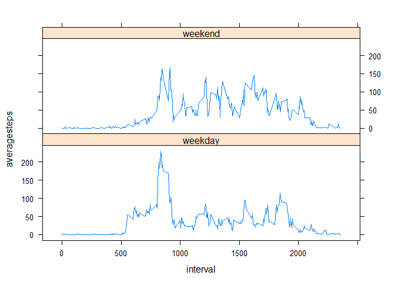

# Reproducible Research - Course Project 1
Rafael Lavagna  
24 de febrero de 2018  


## Assignment 1

### Loading and preprocessing the data


```r
rm(list=ls())

setwd("C:/Users/Julio/Desktop/Maestría Energía 2017/Coursera/Data Science Specialization JH/Curso 5 - Reproducible Research/Assignments/W2")

data <- read.csv("activity.csv",header = TRUE,na.strings = "NA")

head(data)
```

```
##   steps       date interval
## 1    NA 2012-10-01        0
## 2    NA 2012-10-01        5
## 3    NA 2012-10-01       10
## 4    NA 2012-10-01       15
## 5    NA 2012-10-01       20
## 6    NA 2012-10-01       25
```

```r
str(data)
```

```
## 'data.frame':	17568 obs. of  3 variables:
##  $ steps   : int  NA NA NA NA NA NA NA NA NA NA ...
##  $ date    : Factor w/ 61 levels "2012-10-01","2012-10-02",..: 1 1 1 1 1 1 1 1 1 1 ...
##  $ interval: int  0 5 10 15 20 25 30 35 40 45 ...
```

```r
summary(data)
```

```
##      steps                date          interval     
##  Min.   :  0.00   2012-10-01:  288   Min.   :   0.0  
##  1st Qu.:  0.00   2012-10-02:  288   1st Qu.: 588.8  
##  Median :  0.00   2012-10-03:  288   Median :1177.5  
##  Mean   : 37.38   2012-10-04:  288   Mean   :1177.5  
##  3rd Qu.: 12.00   2012-10-05:  288   3rd Qu.:1766.2  
##  Max.   :806.00   2012-10-06:  288   Max.   :2355.0  
##  NA's   :2304     (Other)   :15840
```

```r
#transform date variable into a date format

data$date <- as.Date(data$date, format = "%Y-%m-%d")
```

### What is mean total number of steps taken per day?

For this part of the assignment, we are going to ignore the missing values in the dataset.


```r
steps_per_day <- tapply(data$steps,data$date,sum,na.omit=T)

hist(steps_per_day,col="red",breaks=20,main="Total steps per day")
```

<!-- -->

Mean and median of the total number of steps taken per day


```r
mean(steps_per_day,na.rm=T)
```

```
## [1] 10767.19
```

```r
median(steps_per_day,na.rm=T)
```

```
## [1] 10766
```

### What is the average daily activity pattern?


```r
steps_per_interval <- tapply(data$steps,data$interval,mean, na.rm=T)

df_spi <- as.data.frame(cbind(unique(data$interval),steps_per_interval))

colnames(df_spi) = c("Interval","Average number of steps")

plot(df_spi,type="l",col ="red",main="Average number of steps per interval")
```

<!-- -->

```r
#Maximum number of steps in average

max <- df_spi$Interval[which.max(df_spi$`Average number of steps`)]

print(max)
```

```
## [1] 835
```

### Imputing missing values


```r
#Determine total NA values in the dataset

na_count <-sapply(data, function(y) sum((is.na(y))))

na_count <- data.frame(na_count)

print(na_count)
```

```
##          na_count
## steps        2304
## date            0
## interval        0
```

```r
#Fill in all the missing values

data_2 <- data

data_2$steps = ifelse(is.na(data$steps), df_spi$`Average number of steps`, data$steps)

steps_per_day_2 <- tapply(data_2$steps,data_2$date,sum)

hist(steps_per_day_2,col="blue",breaks=20,main="Total steps per day with missing data filled in")
```

<!-- -->

```r
print(mean(steps_per_day_2))
```

```
## [1] 10766.19
```

```r
print(median(steps_per_day_2))
```

```
## [1] 10766.19
```

The data was filled imputing in each NA the average value across all days for the corresponding 5-minute interval. 
The impact of filling the data using this criteria on the histogram is that it increases the frequency of days with the average of total steps per day. The values of the mean and the median remains unchanged.

### Are there differences in activity patterns between weekdays and weekends?


```r
weekday <- weekdays(data_2$date)

data_3 <- cbind(data_2,weekday)

data_3$weekday <- ifelse((data_3$weekday == "sábado" | data_3$weekday == "domingo"),"weekend","weekday")

data_3$weekday <- as.factor(data_3$weekday)
```


```r
mean_steps <- with(data_3, aggregate(steps, list(interval, weekday), mean))

head(mean_steps)
```

```
##   Group.1 Group.2          x
## 1       0 weekday 2.25115304
## 2       5 weekday 0.44528302
## 3      10 weekday 0.17316562
## 4      15 weekday 0.19790356
## 5      20 weekday 0.09895178
## 6      25 weekday 1.59035639
```

```r
colnames(mean_steps) <- c("interval","weekday","averagesteps")

library(lattice)

xyplot(averagesteps ~ interval | weekday, data = mean_steps, layout = c(1, 2),type="l")
```

<!-- -->


The plot shows that whereas on weekends the total number of steps seems to be higher (bigger area under the curve), on weekdays exists the highest peak of the data set (over 200 steps in a 5-minute interval). 
